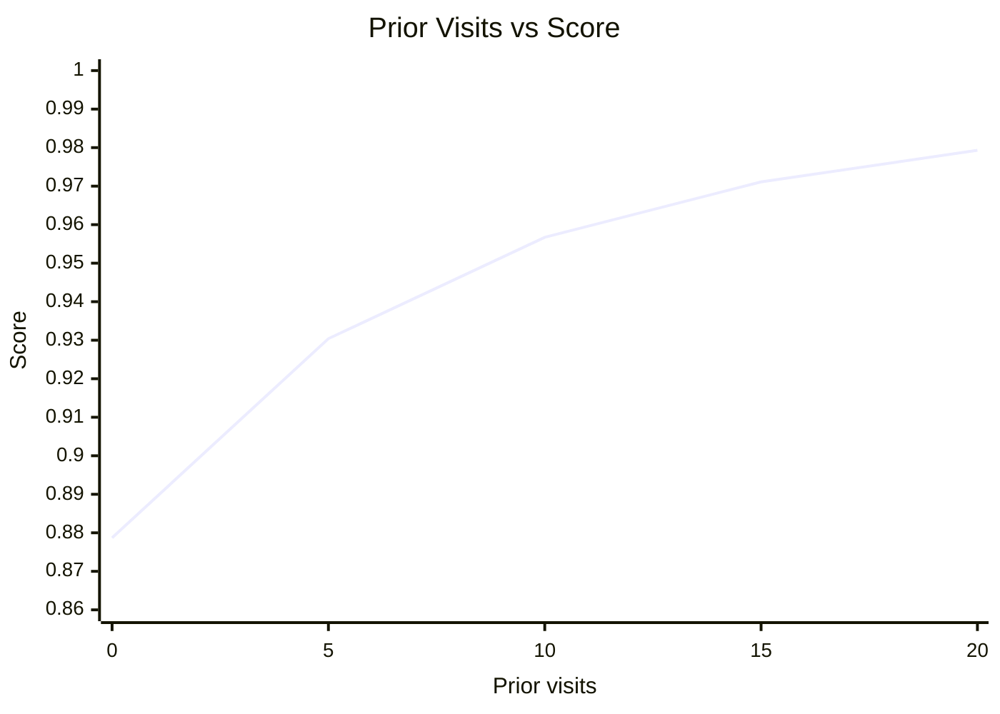
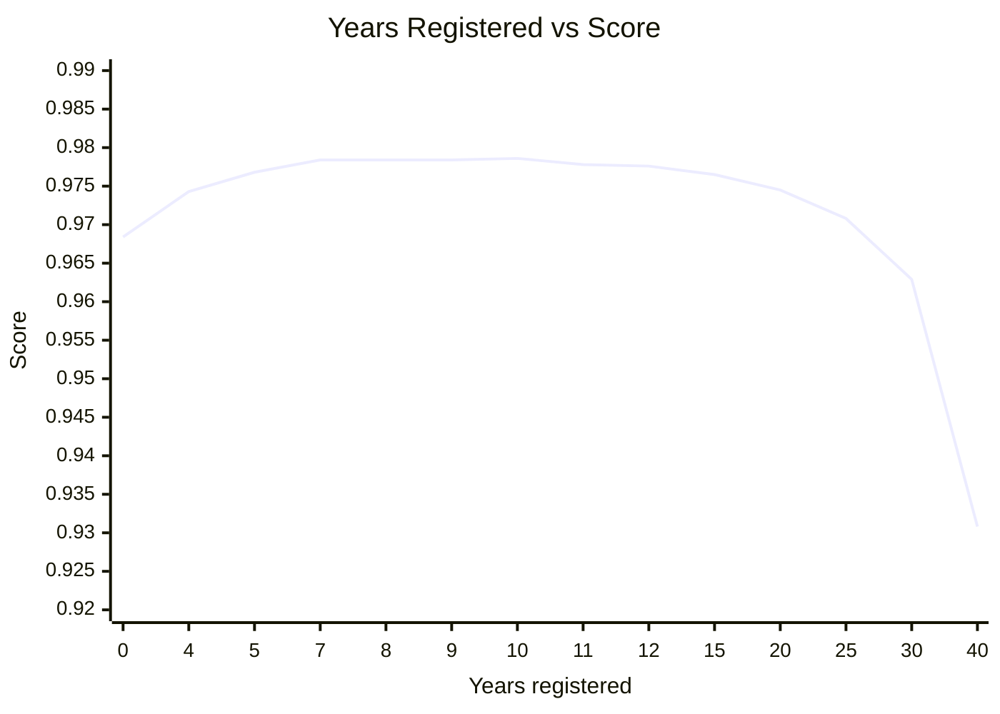
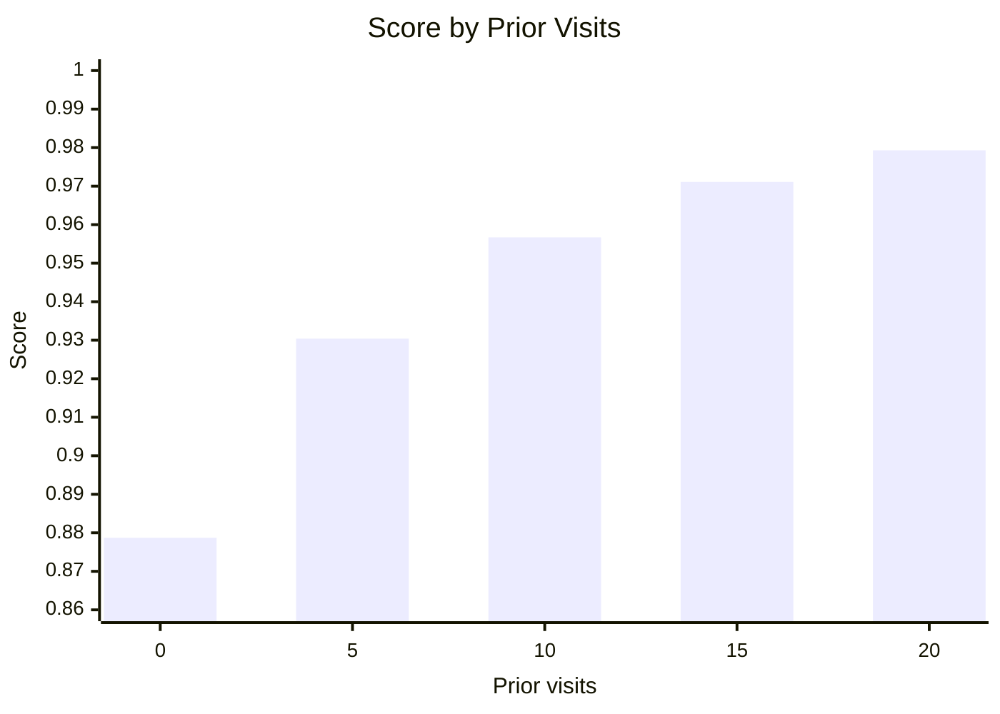
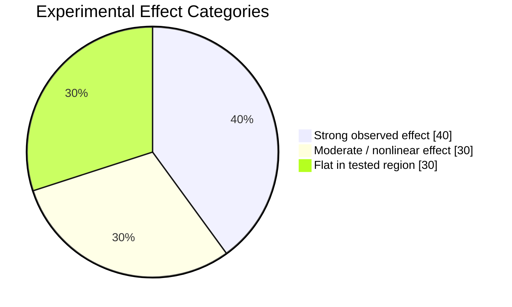

# round-2 — Investigate

Team: BB-002  
Queries used: 113

## Summary

Round 2 investigated how the black-box model responds when individual inputs are varied while the other inputs are held controlled. The experiments show that the model is **not governed by one simple universal ratio**. Several inputs have strong nonlinear relationships with the score, while some tested inputs appeared flat.

The **maximum observed score was 0.9793 (APPROVE)**. The best observed configuration was approximately:

| Input | Best observed |
|---|---:|
| age | 73 |
| baseline_score | ≈ 772–773 |
| comorbidity_ratio | 0 |
| dependants | 0–6 (flat in the optimized configuration) |
| prior_visits | 20 (maximum allowed) |
| recent_admissions | 0 |
| requested_beds | 0–100 appeared flat |
| vitals_index | 0–100 appeared flat |
| ward | B |
| years_registered | ≈ 10.5–10.6 |
| score | **0.9793** |

## Key relationships

### 1. `prior_visits` — strong positive, saturating relationship

With the other inputs controlled, the observed scores were:

| Prior visits | Score |
|---:|---:|
| 0 | 0.8787 |
| 5 | 0.9304 |
| 10 | 0.9567 |
| 15 | 0.9711 |
| 20 | 0.9793 |

From 0 to 20 visits, the score increased by **0.1006**, about **11.4% relative to the starting score**. The marginal gain became smaller as visits increased.

The experiment respected the system limit: **20 was the maximum allowed value**, so the relationship was not extrapolated beyond 20.

### 2. `comorbidity_ratio` — strongest tested negative effect

With the controlled baseline setup:

| Comorbidity ratio | Score |
|---:|---:|
| 0 | 0.9786 |
| 0.1 | 0.9758 |
| 0.2 | 0.9692 |
| 0.3 | 0.9565 |
| 0.4 | 0.9476 |
| 1.0 | 0.8177 |

Changing `comorbidity_ratio` from 0 to 1 reduced the score by **0.1609**, approximately **16.4% relative to the starting score**. This was the largest observed full-range score change among the tested individual sweeps.

### 3. `recent_admissions` — negative, nonlinear relationship

| Recent admissions | Score |
|---:|---:|
| 0 | 0.9786 |
| 1 | 0.9782 |
| 2 | 0.9659 |
| 3 | 0.9595 |
| 4 | 0.9555 |
| 5 | 0.9406 |

From 0 to 5 admissions, the score decreased by **0.0380**, about **3.9% relative to the starting score**. The changes were not uniform, so this should not be treated as a simple linear penalty.

### 4. `years_registered` — inverted-U / non-monotonic relationship

The score first increased and then decreased:

| Years registered | Score |
|---:|---:|
| 0 | 0.9684 |
| 4 | 0.9743 |
| 5 | 0.9768 |
| 7 | 0.9784 |
| 8 | 0.9784 |
| 9 | 0.9784 |
| 10 | 0.9786 |
| 11 | 0.9778 |
| 12 | 0.9776 |
| 15 | 0.9765 |
| 20 | 0.9745 |
| 25 | 0.9708 |
| 30 | 0.9629 |
| 40 | 0.9308 |

A later fine sweep around the best region found approximately:

- 10.35 → 0.9792
- 10.40 → 0.9792
- **10.50 → 0.9793**
- **10.60 → 0.9793**
- 10.70 → 0.9790
- 10.75 → 0.9790

Therefore the best observed region was approximately **10.5–10.6 years**.

### 5. `baseline_score` — non-monotonic relationship

A broader sweep was performed with `years_registered = 20`:

| Baseline score | Score |
|---:|---:|
| 300 | 0.8640 |
| 600 | 0.9631 |
| 700 | 0.9714 |
| 750 | 0.9745 |
| 775 | 0.9744 |
| 800 | 0.9738 |
| 850 | 0.9717 |
| 875 | 0.9716 |
| 900 | 0.9703 |

This showed that simply increasing `baseline_score` does not always increase the output. In that `years_registered = 20` sweep, the strongest region was around **750**.

A separate fine search around the overall optimized configuration found the best region near **772–773**, reaching the overall observed maximum of **0.9793** when combined with the other optimized inputs. These are different controlled conditions, so the two observations should not be treated as contradictory.

### 6. `age` — weak curved effect

Across the controlled age sweep around 70–75, scores stayed in a narrow range of roughly **0.9769–0.9786**. The best observed region was approximately **age 73**, but the effect was much smaller than the effects of comorbidity, prior visits, or recent admissions.

### 7. `ward` — smaller categorical effect

The controlled ward comparison gave approximately:

| Ward | Score |
|---|---:|
| A | 0.9763 |
| B | **0.9786** |
| C | 0.9750 |
| D | 0.9697 |

Ward B was best among the tested categories, but the effect was smaller than the strongest numerical effects.

### 8. `dependants` — flat in the tested optimized configuration

With the optimized configuration, `dependants` values from **0 through 6** all produced **0.9793**. No score change was observed in that tested range.

### 9. `requested_beds` and `vitals_index` — flat in the tested range

The tested values **0, 50, and 100** for both `requested_beds` and `vitals_index` produced the same observed score under the controlled baseline setup. Therefore no meaningful sensitivity was observed in those tested ranges.

## Relative effect ratios

Using the observed full-range score changes only:

| Comparison | Absolute score-change ratio |
|---|---:|
| `prior_visits` (0→20) vs `recent_admissions` (0→5) | **2.65×** |
| `comorbidity_ratio` (0→1) vs `recent_admissions` (0→5) | **4.23×** |
| `comorbidity_ratio` (0→1) vs `prior_visits` (0→20) | **1.60×** |

These are **observed range comparisons**, not causal coefficients or feature-importance weights. The input ranges are different, so the ratios should not be interpreted as universal model weights.

## Experimental method

The main approach was controlled black-box probing: vary one input while keeping the remaining inputs fixed, then inspect the score change. We also used finer sweeps around promising regions instead of assuming that relationships were linear.

A representative baseline used:

- age = 73
- baseline_score = 750
- comorbidity_ratio = 0
- dependants = 0
- prior_visits = 20
- recent_admissions = 0
- requested_beds = 100
- vitals_index = 100
- ward = B
- years_registered = 10

The later optimization around the best observed score refined `baseline_score` to approximately **772–773** and `years_registered` to approximately **10.5–10.6**, producing the maximum observed score of **0.9793**.

## What we ruled out

- A simple monotonic relationship for `years_registered` was ruled out: the score rises and then falls.
- A simple monotonic relationship for `baseline_score` was ruled out in the tested ranges.
- `requested_beds` did not show meaningful sensitivity across the tested 0/50/100 values.
- `vitals_index` did not show meaningful sensitivity across the tested 0/50/100 values.
- `dependants` from 0 through 6 did not change the observed score in the optimized configuration.
- The `prior_visits` relationship could not be extrapolated beyond 20 because 20 was the allowed maximum.
- The experiments do not justify treating the observed score-change ratios as causal feature weights.

## What remains uncertain

The experiments establish strong one-variable relationships, but they do **not** establish an exact two-variable interaction formula. Paired sweeps would be needed to determine whether the effect of one input changes systematically with the level of another input.

Therefore, the strongest defensible conclusion from Round 2 is that the black-box model contains **nonlinear, feature-specific relationships**, with `comorbidity_ratio` and `prior_visits` showing the largest tested score changes, and with an optimized observed configuration reaching **0.9793 (APPROVE)**.

## PDF Results and Visual Evidence — `Round_2_Blackbox_Relationships_Final.pdf`

The final Round 2 PDF is incorporated into this report as part of the experiment record. It summarizes the optimized configuration and contains the relationship graphs, corrected bar graph, and qualitative pie chart.

### PDF headline result

The PDF reports a **maximum observed score of 0.9793 (APPROVE)** and concludes that the experiments indicate **nonlinear relationships rather than one simple universal ratio**.

### Key relationships shown in the PDF

The PDF's summary identifies the following relationships:

- **Prior visits:** strong positive, saturating relationship. `20` is the maximum allowed value and gave the best score.
- **Years registered:** inverted-U relationship, with the best observed region around **10.5–10.6 years**.
- **Baseline score:** best observed region around **772–773** in the optimized configuration.
- **Comorbidity ratio:** strong nonlinear negative effect; `0` was best.
- **Recent admissions:** strong nonlinear negative effect; `0` was best.
- **Age:** best observed region around **73**.
- **Ward:** `B` was best among the tested wards.
- **Dependants:** values `0–6` were flat at **0.9793** in the optimized configuration.

### Best observed configuration from the PDF

| Input | Best observed |
|---|---:|
| Age | 73 |
| Baseline score | ≈ 772–773 |
| Comorbidity ratio | 0 |
| Dependants | 0–6 (flat) |
| Prior visits | 20 (maximum) |
| Recent admissions | 0 |
| Requested beds | 0–100 appeared flat |
| Vitals index | 0–100 appeared flat |
| Ward | B |
| Years registered | ≈ 10.5–10.6 |
| Score | **0.9793 (APPROVE)** |

This matches the optimized configuration described in the experimental findings and is the central result of the final PDF.

### Relationship graphs in the PDF

#### Prior Visits vs Score

The PDF plots the controlled prior-visits sweep as:

| Prior visits | Score |
|---:|---:|
| 0 | 0.8787 |
| 5 | 0.9304 |
| 10 | 0.9567 |
| 15 | 0.9711 |
| 20 | 0.9793 |

The graph shows a clear positive relationship that becomes progressively flatter as prior visits increase. This supports the description of the relationship as **positive and saturating**.

#### Years Registered vs Score

The PDF's line graph shows the score rising from the low-years region to a peak around 10–11 years and then declining as years registered becomes larger. The plotted relationship is therefore **inverted-U / non-monotonic**.

The experimentally observed values underlying this relationship include:

| Years registered | Score |
|---:|---:|
| 0 | 0.9684 |
| 4 | 0.9743 |
| 5 | 0.9768 |
| 7 | 0.9784 |
| 8 | 0.9784 |
| 9 | 0.9784 |
| 10 | 0.9786 |
| 11 | 0.9778 |
| 12 | 0.9776 |
| 15 | 0.9765 |
| 20 | 0.9745 |
| 25 | 0.9708 |
| 30 | 0.9629 |
| 40 | 0.9308 |

The later fine sweep around the peak found approximately **10.5–10.6 years** as the best observed region, with a score of **0.9793**.

### Corrected bar graph in the PDF

The PDF explicitly describes its bar graph as a chart of the **actual measured scores from the controlled prior-visits sweep**, not a feature-importance chart.

The bar values are:

- `0` prior visits → **0.8787**
- `5` prior visits → **0.9304**
- `10` prior visits → **0.9567**
- `15` prior visits → **0.9711**
- `20` prior visits → **0.9793**

Therefore, this chart should be interpreted as an **observed score-versus-input relationship**, not as a ranking of feature importance.

### Qualitative pie chart in the PDF

The PDF also contains a pie chart titled **Experimental Effect Categories**. It groups the observed experimental behavior into three presentation categories:

| Category | Percentage |
|---|---:|
| Strong observed effect | **40%** |
| Moderate / nonlinear effect | **30%** |
| Flat in tested region | **30%** |

These percentages are explicitly a **presentation summary of the experimental behavior**, not mathematically estimated feature importance. They should therefore not be interpreted as model coefficients or as a statistically calculated distribution of feature importance.

### Overall interpretation of the PDF

Taken together, the PDF provides visual evidence for the same conclusions established by the controlled queries:

1. The model response is **nonlinear**.
2. `prior_visits` has a strong positive, saturating relationship within the allowed range.
3. `years_registered` has an inverted-U relationship with a best observed region around **10.5–10.6** years.
4. `comorbidity_ratio` and `recent_admissions` have negative relationships with the score.
5. The best observed configuration reaches **0.9793 (APPROVE)**.
6. The corrected bar graph shows measured scores, **not feature importance**.
7. The pie chart is a qualitative presentation summary, **not a mathematical feature-importance calculation**.
8. The results support nonlinear, feature-specific relationships rather than a single universal ratio.

---

# PDF Evidence Added to This Report

The following section incorporates the complete analytical content represented in **`Round_2_Blackbox_Relationships_Final.pdf`** without removing or replacing the earlier Round 2 findings. The PDF reports a **maximum observed score of 0.9793 (APPROVE)** and concludes that the experiments show nonlinear relationships rather than one simple universal ratio.

## PDF key relationships

The PDF identifies these relationships:

- **Prior visits:** strong positive, saturating relationship; **20 is the maximum allowed** and gave the best observed score.
- **Years registered:** inverted-U relationship; best observed region approximately **10.5–10.6 years**.
- **Baseline score:** best observed region approximately **772–773**.
- **Comorbidity ratio:** strong nonlinear negative effect; **0 is best**.
- **Recent admissions:** strong nonlinear negative effect; **0 is best**.
- **Age:** best observed region approximately **73**.
- **Ward:** **B** was best among the tested wards.
- **Dependants:** **0–6 were flat at 0.9793** in the optimized configuration.

These points and the best configuration are stated on page 1 of the PDF. 

## PDF best observed configuration

| Input | Best observed |
|---|---:|
| Age | 73 |
| Baseline score | ≈ 772–773 |
| Comorbidity ratio | 0 |
| Dependants | 0–6 (flat) |
| Prior visits | 20 (maximum) |
| Recent admissions | 0 |
| Requested beds | 0–100 appeared flat |
| Vitals index | 0–100 appeared flat |
| Ward | B |
| Years registered | ≈ 10.5–10.6 |
| **Score** | **0.9793 (APPROVE)** |

## Line graph 1 — Prior Visits vs Score

This reproduces the relationship graph shown on page 2 of the PDF using the actual measured values.

### Prior-visits graph data

| Prior visits | Score |
|---:|---:|
| 0 | 0.8787 |
| 5 | 0.9304 |
| 10 | 0.9567 |
| 15 | 0.9711 |
| 20 | 0.9793 |

The graph shows a strong positive relationship that becomes progressively less steep: the model gains more score from the early increases in visits than from later increases.

## Line graph 2 — Years Registered vs Score

This reproduces the second relationship graph shown on page 2 of the PDF.

### Years-registered graph data

| Years registered | Score |
|---:|---:|
| 0 | 0.9684 |
| 4 | 0.9743 |
| 5 | 0.9768 |
| 7 | 0.9784 |
| 8 | 0.9784 |
| 9 | 0.9784 |
| 10 | 0.9786 |
| 11 | 0.9778 |
| 12 | 0.9776 |
| 15 | 0.9765 |
| 20 | 0.9745 |
| 25 | 0.9708 |
| 30 | 0.9629 |
| 40 | 0.9308 |

This is the **inverted-U / non-monotonic** relationship highlighted in the PDF. The score improves toward the 10-year region, then declines as years registered increase further.

## Corrected bar graph — Score by Prior Visits

The PDF's corrected bar graph uses the **actual measured scores from the controlled prior-visits sweep**. It is explicitly **not a feature-importance chart**.

The exact bar values shown in the PDF are:

- 0 visits → **0.8787**
- 5 visits → **0.9304**
- 10 visits → **0.9567**
- 15 visits → **0.9711**
- 20 visits → **0.9793**

The bar graph therefore visualizes the same controlled sweep as the prior-visits line graph, but as a direct score comparison.

## Qualitative pie chart — Experimental Effect Categories

The PDF's pie chart is a **presentation summary**, not mathematically estimated feature importance.

### Pie-chart interpretation

| Experimental effect category | Percentage |
|---|---:|
| Strong observed effect | 40% |
| Moderate / nonlinear effect | 30% |
| Flat in tested region | 30% |
| **Total** | **100%** |

The PDF explicitly cautions that these percentages are a qualitative grouping of the observed experimental behavior, **not mathematically estimated feature importance**.

## Ratios between the observed relationships

The Round 2 experiments also quantify relative changes between selected controlled ranges.

### Prior visits vs recent admissions

- `prior_visits`: 0 → 20 changed score from **0.8787 → 0.9793**
- Absolute score change = **0.1006**
- `recent_admissions`: 0 → 5 changed score from **0.9786 → 0.9406**
- Absolute score change = **0.0380**
- Ratio = **0.1006 / 0.0380 ≈ 2.65×**

Therefore, across these tested ranges, the observed score change from prior visits was about **2.65×** the observed score change from recent admissions.

### Comorbidity ratio vs recent admissions

- `comorbidity_ratio`: 0 → 1 changed score from **0.9786 → 0.8177**
- Absolute score change = **0.1609**
- `recent_admissions`: 0 → 5 changed score by **0.0380**
- Ratio = **0.1609 / 0.0380 ≈ 4.23×**

Therefore, across these tested ranges, the observed score change from comorbidity ratio was about **4.23×** the observed score change from recent admissions.

### Comorbidity ratio vs prior visits

- `comorbidity_ratio`: absolute score change = **0.1609**
- `prior_visits`: absolute score change = **0.1006**
- Ratio = **0.1609 / 0.1006 ≈ 1.60×**

Therefore, across the tested ranges, the observed full-range score change for comorbidity ratio was about **1.60×** the observed full-range score change for prior visits.

> **Important:** These ratios compare observed score changes over the specific tested ranges. They are **not causal coefficients, model weights, or mathematical feature-importance values**.

## Relationship summary from the PDF

| Input | Observed relationship | Best observed region/value |
|---|---|---:|
| `prior_visits` | Strong positive, saturating | 20 |
| `years_registered` | Inverted-U / nonlinear | ≈ 10.5–10.6 |
| `baseline_score` | Non-monotonic in tested experiments | ≈ 772–773 in optimized configuration |
| `comorbidity_ratio` | Strong nonlinear negative | 0 |
| `recent_admissions` | Strong nonlinear negative | 0 |
| `age` | Weak/curved | ≈ 73 |
| `ward` | Categorical difference | B |
| `dependants` | Flat in optimized tested range | 0–6 |
| `requested_beds` | Appeared flat in tested range | 0–100 |
| `vitals_index` | Appeared flat in tested range | 0–100 |

## Overall PDF conclusion

The PDF's visual and numerical evidence supports the same central Round 2 conclusion: the black-box system exhibits **different nonlinear relationships for different inputs**, rather than one universal ratio.

The strongest observed effects were associated with **comorbidity ratio** and **prior visits**. `years_registered` shows a clear inverted-U pattern, while the optimized search around `baseline_score` and `years_registered` produced the maximum observed score of **0.9793 (APPROVE)**.

The PDF's charts should be read together:

1. The **prior-visits line graph** shows the saturating positive relationship.
2. The **years-registered line graph** shows the inverted-U relationship.
3. The **corrected bar graph** presents the actual prior-visits measurements and is not feature importance.
4. The **pie chart** gives a qualitative 40% / 30% / 30% grouping of experimental effect categories and is not mathematical feature importance.
5. The **ratio analysis** compares observed score changes across controlled ranges and should not be interpreted as causal weights.

This completes the written reproduction of the PDF's graphs, chart values, ratios, relationships, best configuration, and interpretation inside `report.md`.
